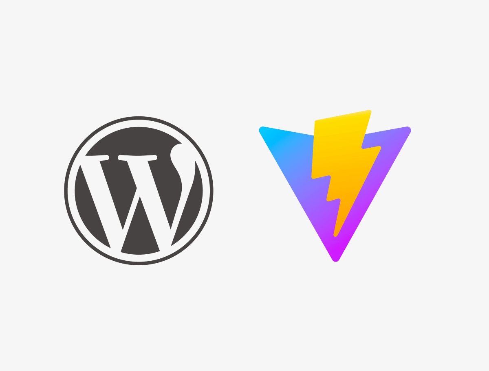

# WordPress Vite.js starter theme

## Under the hood

- [ES6](https://github.com/lukehoban/es6features#readme) for JavaScript
- [SASS](http://sass-lang.com/) preprocessor for CSS following [SASS Guidelines](https://sass-guidelin.es/#the-7-1-pattern)
- [Bootstrap 5](https://getbootstrap.com/docs/5.2/getting-started/introduction/) as CSS framework ([customizable with SASS](https://getbootstrap.com/docs/5.2/customize/sass/))
- [Vite.js](https://vitejs.dev/) to compile theme assets and provide live reload

## Requirements

* [Node](https://nodejs.org/)

## Usage

First, clone this repository in your WordPress themes directory.

Then, run the following commands in the theme's directory :

	npm install

Launch your watch for assets with :

	npm run dev

For production sites, create your build with :

	npm run build

## Vite & WordPress
- All the static assets used in scss or js files (images, fonts, etc.) are copied as-is to the `dist` directory. The other images used directly in php files are <u>not copied</u>.
- To detect dev mode in php there is no `dist` directory, it is added on build.

## Troubleshooting [dev mode]

- Vite needs to know the root path of your project so <u>you cannot use a subdirectory</u> as the root of your WordPress installation.
- If you haven't started the dev server, your assets will not be compiled just `npm run dev` and refresh page.
- In your scss files use the alias `@` to target the `static/` directory. ie : `background-image: url('@/img/logo.png');`
